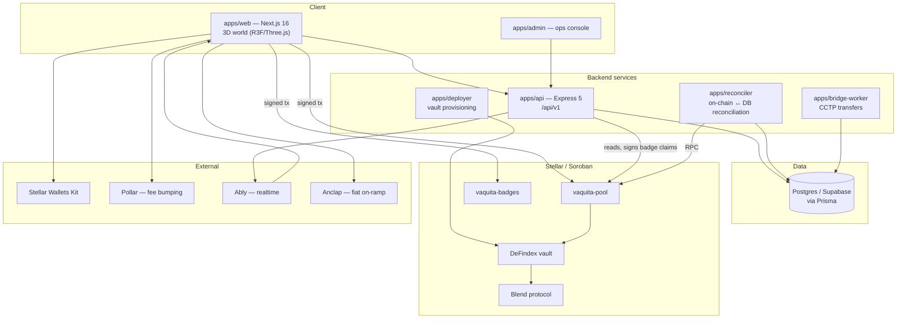
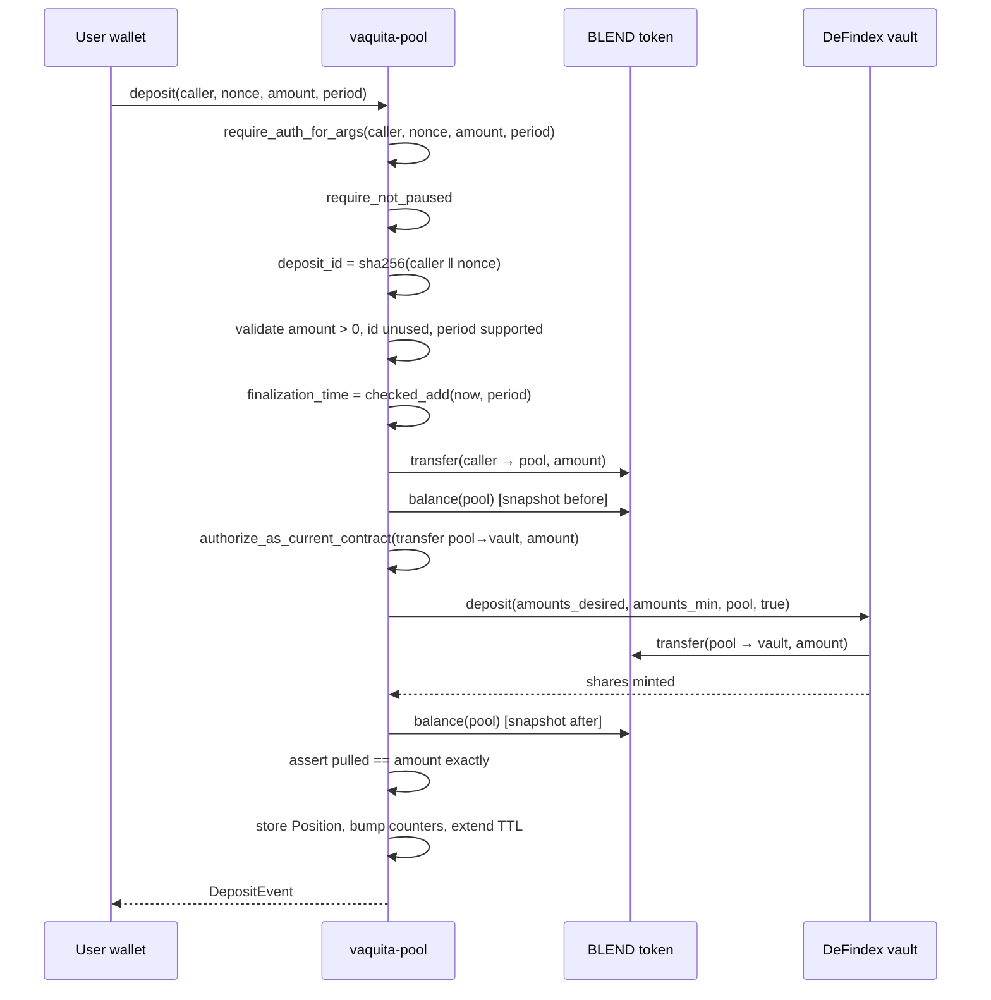
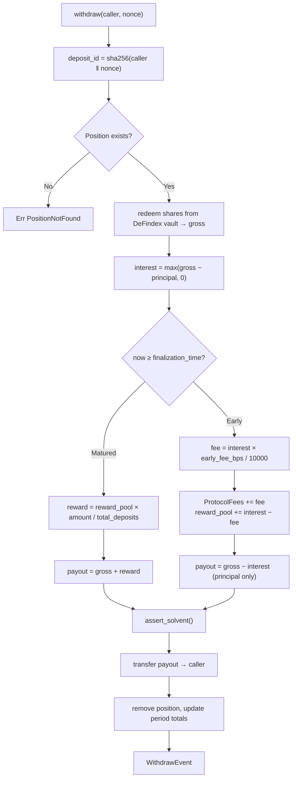

# Vaquita — System Architecture

**Version:** 1.0 · 2026-08-14
**Code state:** branch `dev` @ `603807a`
**Audience:** engineers, auditors, and reviewers of Deliverable 3.5

---

## 1. What Vaquita is

Vaquita is a DeFi savings product wrapped in a gamified 3D world ("Vaquiland"), built on **Stellar / Soroban**.

The financial mechanism is a **time-locked commitment pool with forfeited-yield redistribution**:

1. A user deposits USDC (the Blend-wrapped token) into a pool for a chosen lock period.
2. Deposits are routed into a **DeFindex vault**, which runs Blend lending strategies to generate yield.
3. A user who **holds to maturity** receives principal + their own yield + a pro-rata share of the reward pool.
4. A user who **withdraws early** receives principal only. Their accrued interest is forfeited into the reward pool (minus a protocol fee cut).

The incentive is symmetric and self-funding: early exits subsidise those who stay. No external emissions are required to pay the bonus.

A soulbound **badge** system (achievements, leaderboard placements, milestones) sits alongside the pool as a separate contract, with mints authorised by a backend signature.

---

## 2. System context



**Trust boundaries.** The contracts trust nothing off-chain: all authorisation is on-chain via `require_auth`. The one exception is badge minting, which accepts a **backend Ed25519 signature** — the badges contract deliberately delegates eligibility to the API, because achievement criteria (streaks, leaderboard rank, referrals) are off-chain facts.

---

## 3. Repository layout

pnpm workspace monorepo. Workspace members are declared in `pnpm-workspace.yaml`.

| Path | Role | In workspace |
|---|---|---|
| `apps/web` | Next.js 16 frontend (App Router, Turbopack). 3D via Three.js / React Three Fiber. Zustand + TanStack Query. | ✅ |
| `apps/api` | Express 5 HTTP API, all routes under `/api/v1`. Structured logging via `pino`. | ✅ |
| `apps/admin` | Internal operations console. | ✅ |
| `apps/reconciler` | Scheduled job reconciling on-chain events against the database. | ✅ |
| `apps/bridge-worker` | Polls and advances CCTP bridge transfers. | ✅ |
| `apps/deployer` | One-shot script to deploy and configure DeFindex vaults. | ✅ |
| `apps/supabase` | SQL migrations, seeds, local Docker Compose. | — |
| `packages/db` | Prisma schema (23 models) + generated client. **Canonical data access.** | ✅ |
| `packages/shared` | Shared types, Zod schemas, helpers, badge/leaderboard services. | ✅ |
| `packages/ui`, `packages/avatar` | Shared UI components and avatar rendering. | ✅ |
| `contracts/` | Soroban Rust workspace: `vaquita-pool`, `vaquita-badges`. | — (Cargo) |
| `analytics/` | Analytics workspace. | ✅ |

### Commands

```bash
pnpm install
pnpm dev            # api + admin + web in parallel
pnpm dev:all        # every app
pnpm build          # all packages and apps
pnpm typecheck

cd contracts
cargo test --workspace     # 169 tests
make build                 # compile vaquita_pool.wasm
make coverage              # llvm-cov → lcov.info + HTML
make fmt
```

---

## 4. On-chain layer

Two independent contracts. `#![no_std]`, target `wasm32v1-none`, `soroban-sdk 22.0.3` (→ 22.0.11 resolved).

### 4.1 `vaquita-pool`

The financial core. All admin config lives in **instance** storage; positions live in **persistent** storage so each has an independently archivable TTL.

**Storage keys** (`DataKey`): `Admin`, `BlendToken`, `DeFindexVaultAddress`, `BasisPoints`, `EarlyWithdrawalFee`, `ProtocolFees`, `Positions(BytesN<32>)`, `Periods(u64)`, `SupportedLockPeriod(u64)`, `PositionCount`, `PositionCountForPeriod(u64)`, `Paused`, `Version`, `UpgradesLocked`, `UpgradeTimelockSecs`, `PendingUpgradeHash`, `UpgradeReadyAt`, `TotalPrincipal`, `TotalRewardPool`.

```rust
pub struct Position {
    pub owner: Address,
    pub token: Address,        // captured at deposit — withdrawal always settles in this asset
    pub amount: i128,
    pub shares: i128,          // DeFindex vault shares
    pub finalization_time: u64,
    pub lock_period: u64,
}

pub struct Period {
    pub reward_pool: i128,
    pub total_deposits: i128,
}
```

**Module map**

| Module | Responsibility |
|---|---|
| `lib.rs` | `contractimpl` — all public entry points |
| `positions.rs` | Persistent position CRUD, counters, TTL policy |
| `vault_adapter.rs` | DeFindex deposit/withdraw + repoint guard |
| `accounting.rs` | Solvency invariant, principal/reward trackers |
| `arithmetic.rs` | `checked_add/sub/mul/div` helpers |
| `token_config.rs` | BLEND token address + fail-closed repoint |
| `admin.rs`, `pause.rs`, `upgrade.rs` | Ownership, pause, two-phase timelocked upgrade |
| `events.rs`, `error.rs`, `types.rs` | Event emission, 28 typed errors, data model |
| `defindex_vault.rs` | `contractimport!` client for the vendored vault WASM |

**Public entry points**

*User:* `deposit(caller, nonce, amount, period)` · `withdraw(caller, nonce)` · `refresh_position_ttl(deposit_id)`
*Views:* `compute_deposit_id(caller, nonce)` · `get_position(deposit_id)` · `get_period_data(period)` · `is_paused()` · `version()` · `check_solvency()`
*Admin:* `withdraw_protocol_fees()` · `add_rewards(period, amount)` · `update_early_withdrawal_fee(bps)` · `add_lock_period(secs)` · `remove_lock_period(period)` · `set_defindex_vault(addr)` · `set_blend_token(addr)` · `pause()` / `unpause()`
*Governance:* `propose_upgrade(hash)` · `cancel_upgrade()` · `execute_upgrade()` · `lock_upgrades_forever()` · `update_upgrade_timelock_secs(secs)`

**Key constants:** `MAX_LOCK_PERIOD_SECS` = 2 years · `MIN_UPGRADE_TIMELOCK_SECS` = 1 hour · position TTL extends to ≈90 days · early-withdrawal fee capped at 2000 bps (20%).

### 4.2 Deposit flow



The before/after balance assertion is the fix for HIGH finding `02a02675` — it caps what the vault can pull even if it replays the authorization entry.

### 4.3 Withdrawal flow



Because the id is derived from `caller`, a position found at step B is provably owned by the caller — no separate ownership check is required.

### 4.4 `vaquita-badges`

Soulbound NFTs. `transfer` is a required interface method that **always** returns `Err(SoulboundToken)`.

Mints are authorised by a **backend Ed25519 signature** over the claim, verified on-chain against a stored signing key (rotatable via `update_signing_key`). Entry points: `mint_badge`, `owner_of`, `badge_type_of`, `has_claimed`, `total_supply`, `update_edition_cap`, `update_signing_key`, plus the same pause/upgrade governance surface as the pool.

**Badge behaviour is data-driven,** not hardcoded. Two columns on `achievements` govern it:

| Column | Values | Meaning |
|---|---|---|
| `refresh_policy` | `auto` \| `manual` | Backend re-signs on demand, or requires admin action |
| `cycle_scoped` | boolean | True for leaderboard badges tied to a specific closed cycle |

**Eligibility gate:** `profiles_achievements` is the single source of truth. `GET /api/v1/claim/:network` checks for a row there before signing; leaderboard badges additionally verify rank via lazy lookup (`getLeaderboardRankForWallet`) rather than a precomputed cron.

**Cycle IDs:** `YYYYMM` for production monthly cycles; 10-digit Unix epoch seconds when `CYCLE_DURATION_MS` is set (test only). Milestone/manual badges use `cycle_id = 0`.

**TTL policy:** badges always extend to the ledger maximum — a soulbound badge must never expire. This is a deliberate, documented recurring-fee trade-off (see `docs/security-review.md` §5.1, `ineffective-extend-ttl`).

### 4.5 Upgrade governance

Both contracts share the same model:

```
propose_upgrade(hash)  →  wait ≥ UpgradeTimelockSecs  →  execute_upgrade()
                       ↘  cancel_upgrade()
lock_upgrades_forever() — irreversible; blocks BOTH propose and execute
```

Default timelock 48 h, floor 1 h. `execute_upgrade` bumps `Version` and clears pending state before calling `update_current_contract_wasm`. Runbooks: `docs/vaquita-pool-upgrade-runbook.md`, `docs/admin-key-rotation-runbook.md`.

---

## 5. Off-chain layer

### 5.1 `apps/api`

Express 5, routes under `/api/v1`: `ably`, `auth`, `badge`, `badges`, `bridge`, `config`, `deposit`, `explore`, `follows`, `health`, `leaderboard`, `map-likes`, `notifications`, `profile`, `referral`, `time`, `user`, `wallets`.

Responsibilities: profile and social graph, badge claim signing, deposit/withdraw orchestration metadata (including **nonce allocation**), leaderboard computation, notifications, bridge status, and network/token config.

`.env` files are per-environment (`.env`, `.env.dev`, `.env.staging`, `.env.production`) and are treated as secret — never read directly, only loaded by the process.

### 5.2 `apps/reconciler`

Reconciles on-chain events against the database on a schedule (GitHub Actions). Maintains a cursor in `config.reconciliation_state`, re-scanning a 20-ledger overlap each run with a 500-ledger fallback lookback, clamped to the RPC retention window.

**Fault tolerance:** stellar-rpc rejects `getHealth` with JSON-RPC `-32603` when its last ingested ledger is older than the node's max-healthy latency (30 s). Because the node is lagging rather than broken, the reconciler retries the health probe 3× at 15 s intervals and then **soft-skips** the run, leaving the cursor untouched so the next run re-scans the gap. A non-latency error still hard-fails. The RPC probe runs *before* any database access so a skipped run costs zero queries.

### 5.3 `apps/bridge-worker`

Advances CCTP bridge transfers between Stellar and EVM chains, driven by the `bridge_transfers` table. Uses a `processing_lease_until` column for at-most-once processing across workers, with `retry_count` and `last_polled_at` for backoff.

### 5.4 `apps/web`

Next.js 16 (App Router + Turbopack). The 3D world uses Three.js / React Three Fiber. Wallet connectivity via `@creit.tech/stellar-wallets-kit`; **Pollar** fee-bumps badge mints so users never need to hold XLM. State is Zustand (client) + TanStack Query (server), with realtime pushed over Ably.

Layout: `src/app` (routes), `src/components`, `src/core-ui` (hooks + design system), `src/networks` (chain config), `src/helpers`.

---

## 6. Data layer

Postgres (Supabase), accessed through **Prisma** (`packages/db`, 23 models). There are **no FK constraints** — relations are enforced at the application layer.

| Domain | Tables |
|---|---|
| **Financial** | `tokens`, `deposits`, `withdrawals`, `config` |
| **Badges** | `achievements`, `badge_claims`, `profiles_achievements`, `profiles_achievements_unlocks`, `rewards`, `profiles_rewards` |
| **Social** | `profiles`, `follows`, `follow_suggestion_dismissals`, `saved_wallets`, `notifications` |
| **World** | `map_objects`, `profiles_map_items`, `profiles_map_objects` |
| **Bridge** | `bridge_transfers` |

Most tables carry `created_at` / `updated_at` and a nullable `deleted_at` (soft delete).

**On-chain ↔ off-chain join key.** `deposits.deposit_id_hex` holds the contract-derived `sha256(caller ‖ nonce)`, and the per-wallet `nonce` is stored alongside it under a `UNIQUE(wallet_address, nonce)` constraint. The nonce is allocated **off-chain** deliberately: an on-chain counter could expire or reset under TTL archival, whereas a monotonic DB counter never collides. Concurrency is handled by the unique constraint plus retry.

---

## 7. External integrations

| Integration | Purpose | Failure posture |
|---|---|---|
| **DeFindex** | Soroban yield vault holding pool principal | Guarded: exact-pull assertion, checked vector access, repoint blocked while positions are open |
| **Blend** | Underlying lending yield source | Indirect, via DeFindex |
| **Stellar Wallets Kit** | Multi-wallet browser support | Client-side |
| **Pollar** | Fee bumping for badge mints | Degrades to user-paid fees |
| **Ably** | Realtime push to frontend | Non-critical; UI falls back to polling |
| **Supabase / Postgres** | All off-chain state | Critical |
| **Anclap** | Fiat on-ramp (ARS → USDC, SEP-24) | Isolated flow |

> Testnet Blend and DeFindex addresses change on every testnet reset — see `contracts/README.md`.

---

## 8. Testing, coverage, CI

**Contracts:** 169 tests (112 pool, 57 badges), all passing. Coverage: **Functions 100% · Lines 99.67% · Regions 95.96%.**

Test organisation mirrors risk: `success.rs` (happy paths), `security_fixes.rs` (regression tests per finding), `conservation.rs` (randomised solvency property test), `upgrade.rs`, `vault_repoint.rs`, `coverage_gaps.rs`, plus `mock_defindex_vault.rs` — a `#![cfg(test)]` mock with deliberate hooks for simulating malicious vault behaviour.

**CI** (`.github/workflows/contracts-ci.yml`) triggers on `contracts/**`: `cargo test` → `stellar contract build` → `cargo llvm-cov` → LCOV to Codecov. Threshold: 80% lines on the `contracts` flag.

The residual uncovered ~4% of regions are unreachable defensive branches (`checked_*` overflow arms, `NotInitialized` arms) — intentional and accepted rather than chased.

---

## 9. Known architectural debt

Carried forward from `docs/security-review.md` §4 so it is visible in one place:

1. **`soroban-sdk` is five majors behind** (22.0.3 → 27.0.6). Largest real gap; needs a planned migration with a storage/TTL semantics re-audit.
2. **Lock-period ceiling (2 y) exceeds position TTL (~90 d).** Long-locked positions archive before maturity and need on-demand restore; the frontend does not currently do this. Latent unless a >90 d period is configured.
3. **No event on `update_upgrade_timelock_secs`** in either contract — a security-relevant admin action invisible to off-chain monitors.
4. **DeFindex vault WASM has no pinned upstream revision** — the binary is committed, its SHA-256 matches, and the provenance README is now tracked, but the source commit field is still a placeholder and cannot be resolved from this repository.
5. **Cross-stack nonce migration not fully validated** — the ABI change from `deposit_id: String` to `nonce: u64` is implemented across DB/API/web but still needs an end-to-end testnet smoke test.

---

## 10. Related documents

| Document | Contents |
|---|---|
| `docs/security-review.md` | Consolidated security review — 40 findings, severity and resolution status |
| `docs/scout-soroban-report.md` | Full CoinFabrik Scout run, per-detector triage |
| `docs/soroban-analyzer-report.md` | soroban-analyzer run and why it is not recommended |
| `docs/contracts-security-findings-checklist.md` | Team remediation tracker |
| `docs/vaquita-badges-whitepaper.md` | Badge system design reference |
| `docs/vaquita-pool-upgrade-runbook.md` | Timelocked upgrade procedure |
| `docs/admin-key-rotation-runbook.md` | Admin key rotation |
| `docs/mainnet-readiness-runbook.md` | Mainnet launch checklist |
| `docs/cctp-bidirectional-bridge-prd.md` | Bridge design |
| `contracts/README.md` | Contract build/deploy, external addresses |
